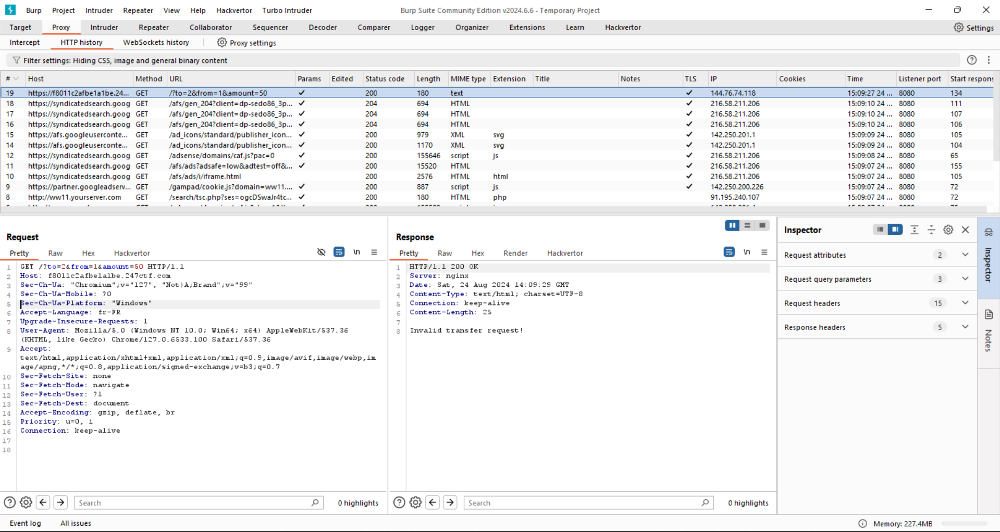
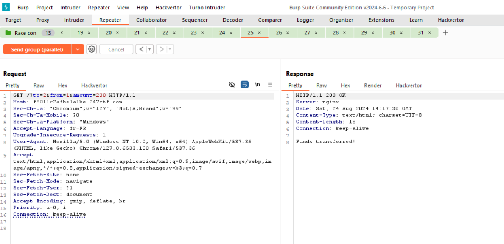

**\#** [ACID FLAG BANK](https://247ctf.com/dashboard#collapse-c61)
**(Web)**

**\## Intro**

This is my write-up for the Web challenge \"[ACID FLAG
BANK](https://247ctf.com/dashboard#collapse-c61)\" on the CTF site
247CTF.com.

**\## Challenge Details**

The challenge involves finding a way to increase the total available
funds and buy a flag.

**\## Steps to Solve**

**\### 1. Access the Application**

Start by accessing the web application provided for the challenge.

**\### 2. Analyze the Provided Code**

\<?php\
require_once(\'flag.php\');\
\
class ChallDB\
{\
    public function \_\_construct(\$flag)\
    {\
        \$this-\>pdo = new SQLite3(\'/tmp/users.db\');\
        \$this-\>flag = \$flag;\
    }\
 \
    public function updateFunds(\$id, \$funds)\
    {\
        \$stmt = \$this-\>pdo-\>prepare(\'update users set funds = :funds where id = :id\');\
        \$stmt-\>bindValue(\':id\', \$id, SQLITE3_INTEGER);\
        \$stmt-\>bindValue(\':funds\', \$funds, SQLITE3_INTEGER);\
        return \$stmt-\>execute();\
    }\
\
    public function resetFunds()\
    {\
        \$this-\>updateFunds(1, 247);\
        \$this-\>updateFunds(2, 0);\
        return \"Funds updated!\";\
    }\
\
    public function getFunds(\$id)\
    {\
        \$stmt = \$this-\>pdo-\>prepare(\'select funds from users where id = :id\');\
        \$stmt-\>bindValue(\':id\', \$id, SQLITE3_INTEGER);\
        \$result = \$stmt-\>execute();\
        return \$result-\>fetchArray(SQLITE3_ASSOC)\[\'funds\'\];\
    }\
\
    public function validUser(\$id)\
    {\
        \$stmt = \$this-\>pdo-\>prepare(\'select count(\*) as valid from users where id = :id\');\
        \$stmt-\>bindValue(\':id\', \$id, SQLITE3_INTEGER);\
        \$result = \$stmt-\>execute();\
        \$row = \$result-\>fetchArray(SQLITE3_ASSOC);\
        return \$row\[\'valid\'\] == true;\
    }\
\
    public function dumpUsers()\
    {\
        \$result = \$this-\>pdo-\>query(\"select id, funds from users\");\
        echo \"\<pre\>\";\
        echo \"ID FUNDS\\n\";\
        while (\$row = \$result-\>fetchArray(SQLITE3_ASSOC)) {\
            echo \"{\$row\[\'id\'\]}  {\$row\[\'funds\'\]}\\n\";\
        }\
        echo \"\</pre\>\";\
    }\
\
    public function buyFlag(\$id)\
    {\
        if (\$this-\>validUser(\$id) && \$this-\>getFunds(\$id) \> 247) {\
            return \$this-\>flag;\
        } else {\
            return \"Insufficient funds!\";\
        }\
    }\
\
    public function clean(\$x)\
    {\
        return round((int)trim(\$x));\
    }\
}\
\
\$db = new challDB(\$flag);\
if (isset(\$\_GET\[\'dump\'\])) {\
    \$db-\>dumpUsers();\
} elseif (isset(\$\_GET\[\'reset\'\])) {\
    echo \$db-\>resetFunds();\
} elseif (isset(\$\_GET\[\'flag\'\], \$\_GET\[\'from\'\])) {\
    \$from = \$db-\>clean(\$\_GET\[\'from\'\]);\
    echo \$db-\>buyFlag(\$from);\
} elseif (isset(\$\_GET\[\'to\'\],\$\_GET\[\'from\'\],\$\_GET\[\'amount\'\])) {\
    \$to = \$db-\>clean(\$\_GET\[\'to\'\]);\
    \$from = \$db-\>clean(\$\_GET\[\'from\'\]);\
    \$amount = \$db-\>clean(\$\_GET\[\'amount\'\]);\
    if (\$to !== \$from && \$amount \> 0 && \$amount \<= 247 && \$db-\>validUser(\$to) && \$db-\>validUser(\$from) && \$db-\>getFunds(\$from) \>= \$amount) {\
        \$db-\>updateFunds(\$from, \$db-\>getFunds(\$from) - \$amount);\
        \$db-\>updateFunds(\$to, \$db-\>getFunds(\$to) + \$amount);\
        echo \"Funds transferred!\";\
    } else {\
        echo \"Invalid transfer request!\";\
    }\
} else {\
    echo highlight_file(\_\_FILE\_\_, true);\
}

The PHP script manages user funds in an SQLite database, allowing fund
transfers, resets, and flag retrieval based on user validation. Users
with more than 247 funds can buy the flag, while fund transfers must
adhere to specified conditions. It includes functions to dump user data,
validate users, and clean input values.

**Steps to Solve**

### 1. understanding and identifying the vulnerability

Lets try to transfer fund from id '1' to '2' :

https://f8011c2afbe1a1be.247ctf.com/?to=2&from=1&amount=247

Funds transferred !

Lets check if fund have really been tranfered :

<http://yourserver.com/yourfile.php?dump>

Yup we have 247 in id 2 and 0 in id 1 .

We can see that theres a lot of stuff happening before the transfer
happens : {width="6.531944444444444in"
height="1.7729166666666667in"}

This indicates that we have a RACE CONIDTION vulnerability in the
transfer function .

Explanation :

A race condition vulnerability occurs when the outcome of a process
depends on the timing or order of events, often because the code does
not properly synchronize access to shared resources or checks conditions
only after performing actions.

You can read about the vulnerability in
<https://portswigger.net/web-security/learning-paths/race-conditions>

### 2. exploiting the vulnerability

Theoretically, if we send multiple requests almost simultaneously to
transfer money between accounts, the checks for both requests might be
processed at the same time. As a result, both requests could pass the
checks and proceed to execute the transactions concurrently.

First , open burpsuite and capture the transfere funds request
{width="6.531944444444444in"
height="3.4784722222222224in"}

Second,Send it to repeater and right click on the request than , move to
tab group and dublicate it many times ,

Than change the 'send ' buttom to Send group (parrallel) :
{width="6.531944444444444in"
height="3.1395833333333334in"}

We got 200 response in only one request lets reset the funds try again
with more dublicated request

{width="6.531944444444444in"
height="3.1680555555555556in"}

Now we got a 200 response in many tabs

Check the fund with ?dump

{width="6.531944444444444in"
height="2.154166666666667in"}

Finnally,it worked and we got more than 247 funds offurtionnaly we buy a
flag now ?flag=1&from=2
