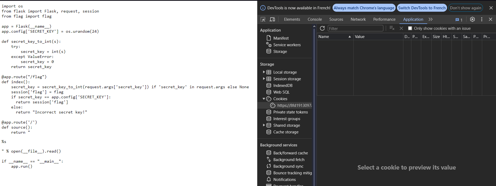
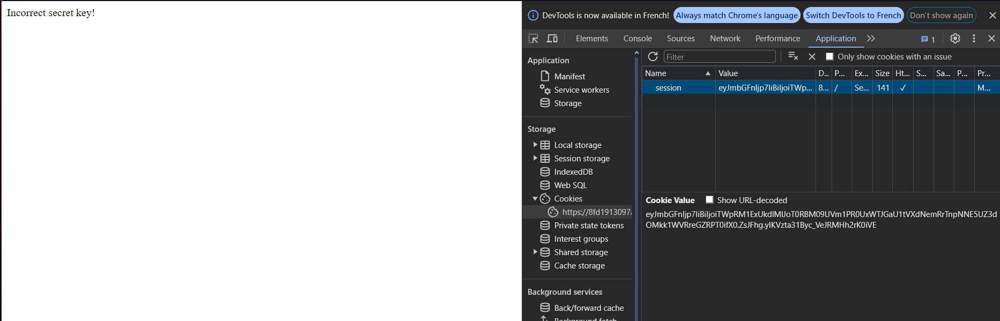
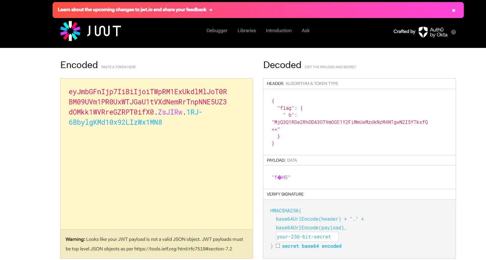

# Secured Session (Web)

## Intro

This is my write-up for the Web challenge "Secured Session" on the CTF site [247CTF.com](https://247ctf.com/).

## Challenge Details

The challenge involves guessing a random secret key to retrieve a flag securely stored in your session.

## Steps to Solve

### 1. Access the Application

Start by accessing the web application provided for the challenge.

### 2. Analyze the Provided Python Code
The provided Python Flask code is as follows:

import os
from flask import Flask, request, session
from flag import flag

app = Flask(__name__)
app.config['SECRET_KEY'] = os.urandom(24)

def secret_key_to_int(s):
    try:
        secret_key = int(s)
    except ValueError:
        secret_key = 0
    return secret_key

@app.route("/flag")
def index():
    secret_key = secret_key_to_int(request.args['secret_key']) if 'secret_key' in request.args else None
    session['flag'] = flag
    if secret_key == app.config['SECRET_KEY']:
        return session['flag']
    else:
        return "Incorrect secret key!"

@app.route('/')
def source():
    return 

if __name__ == "__main__":
    app.run()

    
Analyzing the code, we see it involves cookies and a random key. Let’s check our cookies:

3. Check the Provided Information
Notice that there are no session cookies. Let's check /flag:

The message indicates an incorrect key. Since the key is stored in the session cookie, let's analyze it.

After researching Flask sessions, I found this website that explains how Flask cookies work. I realized that Flask cookies are similar to JSON Web Tokens (JWT), where data is separated by dots (.).

I used jwt.io to analyze the JWT cookie:

By pasting the cookie into the JWT.io decoder, you can see its content, which includes the flag data, base64 encoded.

Decode the base64 string using the following command:

$ echo "MjQ3Q1RGe2RhODA3OTVmOGE1Y2FiMmUwMzdkNzM4NTgwN2I5YTkxfQ==" | base64 -d
The decoded output will be the flag:
247CTF{xxxxxxxx}
